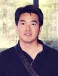

[Home](index.html) | [Papers](papers.html) | [Presentations](presentations.html) | [Participants](participants.html) | [News](news.html)

# Participants
This is a list of all AMASE participants (by __alphabetical__ order of last name). 

---

## PI

[Pete Beckman, Argonne National Laboratory](http://www.mcs.anl.gov/~beckman)

Pete Beckman is a recognized global expert in high-end computing systems. During the past 25 years, his research has been focused on software and architectures for large-scale parallel and distributed computing systems. Pete enjoys the challenging step of moving novel research software into production on extreme-scale systems. After receiving his Ph.D. degree in computer science from Indiana University, he helped found the university's Extreme Computing Laboratory, which focused on parallel languages, portable run-time systems, and collaboration technology. In 1997 Pete joined the Advanced Computing Laboratory at Los Alamos National Laboratory, where he founded the ACL's Linux cluster team and launched the Extreme Linux series of workshops and activities that helped catalyze the high-performance Linux computing cluster community. 

---

## Investigators

[Alok Choudhary, Northwestern University](http://users.eecs.northwestern.edu/~choudhar/)

Alok Choudhary is Henry and Isabel Dever Professor of Electrical Engineering and Computer Science and a Professor of at Kellogg School of Management at Northwestern University. He is the founding director of the Center for Ultra-scale Computing and Information Security (CUCIS), which involves several schools, National Labs and universities.

Professor Choudhary is a fellow of the IEEE (Institute of Electrical and Electronics Engineers), fellow of the ACM (Association of Computing Machinery) and a fellow of the AAAS (American Academy of Advancement of Science).

Prof. Choudhary is the founder, chairman and Chief Scientist of 4C, which is a big-data science and social media analytics company. 4C is formerly known as Voxsup inc., and Prof. Choudhary served as its CEO from 2011-2013.  Prof. Choudhary was a co-founder and VP of Technology of Accelchip Inc., in 2000, which was eventually acquired by Xilinx.

---

[Rajkumar Kettimuthu, Argonne National Laboratory](http://www.mcs.anl.gov/~kettimut/) 

Rajkumar Kettimuthu is a Computer Scientist at Mathematics and Computer Science Division at Argonne National Laboratory and a Senior Fellow at the Computation Institue at The University of Chicago and Argonne National Laboratory. 

---

[Wei-keng Liao, Northwestern University](http://www.ece.northwestern.edu/~wkliao/)

Wei-keng Liao is a Research Professor at the Department of Electrical Engineering and Computer Science, Northwestern University. His research interests include Parallel and distributed file I/O and storage system design. 

---

[Zhengchun Liu](https://lzhengchun.github.io/), [Argonne National Laboratory](http://www.mcs.anl.gov/~zcliu/) 

Zhengchun Liu is a Research Scientist at the Computation Institute of the University of Chicago. He also holds a Joint Appointment at the Data Science and Learning division of Argonne National Laboratory. In this project, he develops end-to-end analytical performance models to transform understanding of the behavior of science workflows in extreme-scale science environments. More specifically, these models are developed to predict the behavior of a science workflow before it is implemented, to explain why performance does not meet design goals, and to architect science environments to meet workflow needs.

---

[Alex Sim, Lawrence Berkeley National Laboratory](https://sdm.lbl.gov/~asim/)

Alex Sim has interests in resource management, data modeling, data mining, and artificial intelligence. He currently works on multi-dimensional, high frequency streaming data analysis algorithms. He has worked on Open Science Grid, DOE SciDAC projects, Earth System Grid Federation, Scientific Data Management Center, Storage Resource Management, Particle Physics Data Grid, two Next Generation Internet projects and HENP Data Grand Challenge project. Alex previously worked for an AI consulting firm where he developed expert systems involving object-oriented programming and artificial intelligence techniques for the Navy and other industries.

---

[Rajesh Sankaran, Northwestern University](http://www.mcs.anl.gov/~rajesh/)

Rajesh is an Assistant Scientist in the Mathematics and Computer Science division of Argonne National Laboratory, and he is the research and development lead on the Waggle research platform and lead engineer on the Array of Things project. He is interested in research topics related to Attentive Sensing, Embedded Computing Systems, Sensor Driven Computation and Computationally Steered Sensing. His research at Argonne has involved close collaborations with Environmental, Urban, High-Performance Computing and Weather/Climate researchers. 

---

[Kesheng (John) Wu, Lawrence Berkeley National Laboratory](https://crd.lbl.gov/departments/data-science-and-technology/sdm/staff/wu/)

John Wu is currently working on indexing technology for searching large datasets. He primarily focuses on improving bitmap index technology with compression, encoding and binning. He is the key developer of FastBit bitmap indexing software, which has been used in a number of applications including High-Energy physics, combustion, network security, and query-driven visualization.  John has also been working on a number of scientific computing projects including developing Thick-Restart Lanczos (TRLan) algorithm for solving eigenvalue problems and devising statistical tests for deterministic effects in broad band time series.  John received a Ph.D. in computer science from the University of Minnesota, an M.S. in physics from the University of Wisconsin-Milwaukee, and a B.S. in physics from Nanjing University, China.

---
